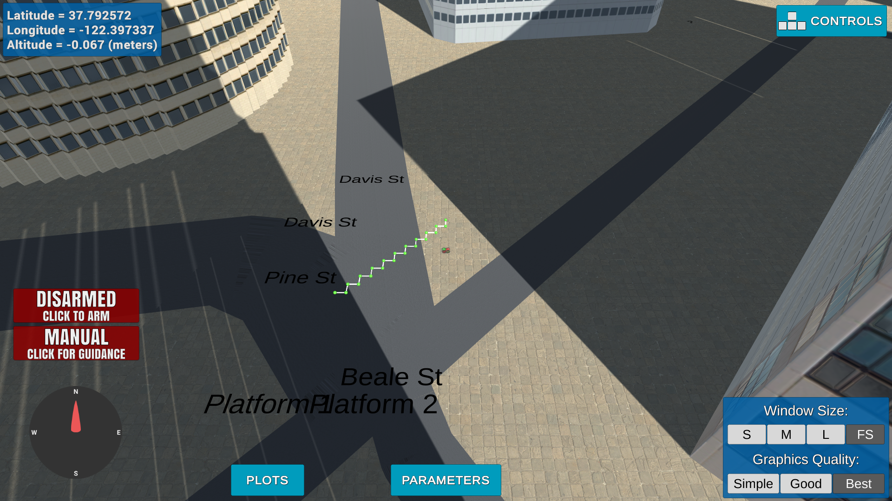
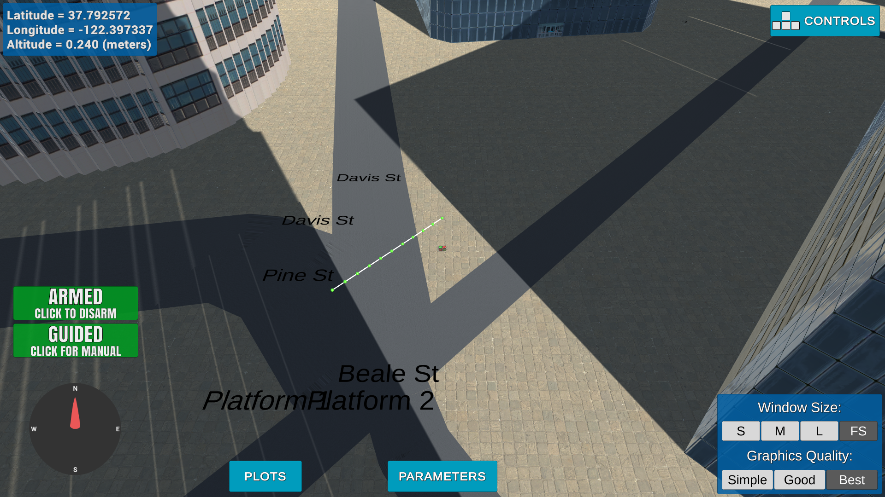
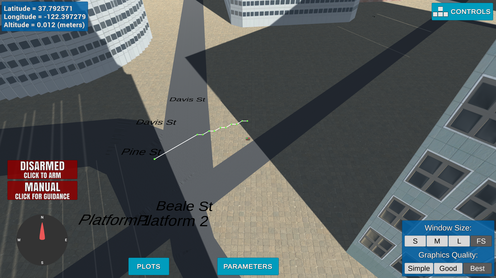
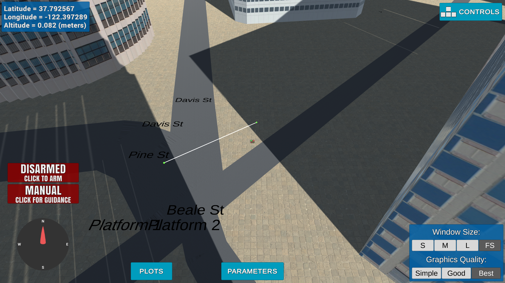

## Project: 3D Motion Planning


---


# Required Steps for a Passing Submission:
1. Load the 2.5D map in the colliders.csv file describing the environment.
2. Discretize the environment into a grid or graph representation.
3. Define the start and goal locations.
4. Perform a search using A* or other search algorithm.
5. Use a collinearity test or ray tracing method (like Bresenham) to remove unnecessary waypoints.
6. Return waypoints in local ECEF coordinates (format for `self.all_waypoints` is [N, E, altitude, heading], where the drone’s start location corresponds to [0, 0, 0, 0].
7. Write it up.
8. Congratulations!  Your Done!

## [Rubric](https://review.udacity.com/#!/rubrics/1534/view) Points
### Here I will consider the rubric points individually and describe how I addressed each point in my implementation.  

---
### Writeup / README

#### 1. Provide a Writeup / README that includes all the rubric points and how you addressed each one.  You can submit your writeup as markdown or pdf.  

You're reading it! Below I describe how I addressed each rubric point and where in my code each point is handled.

### Explain the Starter Code

#### 1. Explain the functionality of what's provided in `motion_planning.py` and `planning_utils.py`
The difference between motion_planning.py and backyard_flyer_solution.py is PLANNING state and plan_path() function. That function creates path from hardcoded start point to harcoded goal point usin A* algorithm without culling waypoints and diagonal motions. Functions provided in planning_utils.py are responsible for creating grid from csv file and A* algorithm.

### Implementing Your Path Planning Algorithm

#### 1. Set your global home position
I read the first line of the csv file, extract lat0 and lon0 as floating point values using regular expression operations and use the self.set_home_position() method to set global home.
```
# read lat0, lon0 from colliders into floating point values
# open colliders.csv file
file = open("colliders.csv", "r")
# read first line
data = file.readline();
# parse the first line with regular expression operations
p = re.compile('(\S+\d)')
m = p.findall(data)
lat0 = float(m[1])
lon0 = float(m[3])
# close the file
file.close()

# set home position to (lon0, lat0, 0)
self.set_home_position(lon0, lat0, 0)
```

#### 2. Set your current local position
I retrieve current global position with global_position attribute. Then I convert this global position to local position using global_to_local() function.
```
# retrieve current global position
start_global_position = self.global_position

# convert to current local position using global_to_local()
start_local_position = global_to_local(start_global_position, self.global_home)
```

#### 3. Set grid start position from local position
Using start local position, I define grid_start as shown as below.
```
# convert start position to current position rather than map center
grid_start = (int(start_local_position[0])-north_offset, int(start_local_position[1])-east_offset)
```

#### 4. Set grid goal position from geodetic coords
I create the desired goal location randomly. I define max and min ranges of goal global position using colliders.csv ranges. Random goal position can be located in any obstacle, so I check goal position whether there is collision or not. If there is a collision I define new goal until no collision.
```
# adapt to set goal as latitude / longitude position and convert
# minimum and maximum north coordinates
north_min = np.floor(np.min(data[:, 0] - data[:, 3]))
north_max = np.ceil(np.max(data[:, 0] + data[:, 3]))

# minimum and maximum east coordinates
east_min = np.floor(np.min(data[:, 1] - data[:, 4]))
east_max = np.ceil(np.max(data[:, 1] + data[:, 4]))

# Define ranges of random global position
min_global_pos = local_to_global(np.array([north_min, east_min, 10.0]), self.global_home)
max_global_pos = local_to_global(np.array([north_max, east_max, 60.0]), self.global_home)

# Define random goal position until grid goal is empty
while not self.is_goal_position_OK:
		self.goal_global_position[0] = np.random.uniform(min_global_pos[0], max_global_pos[0], 1)
		self.goal_global_position[1] = np.random.uniform(min_global_pos[1], max_global_pos[1], 1)
		self.goal_global_position[2] = np.random.uniform(min_global_pos[2], max_global_pos[2], 1)

		# Calc goal local position
		goal_local_position = global_to_local(self.goal_global_position, self.global_home)
		grid_goal = (int(goal_local_position[0])-north_offset, int(goal_local_position[1])-east_offset)

		if grid[grid_goal[0], grid_goal[1]] == 1:
				self.is_goal_position_OK = False
		else: 
				self.is_goal_position_OK = True
```

#### 5. Modify A* to include diagonal motion (or replace A* altogether)

For diagonal motions I added four enum shown below with a cost of sqrt(2) in planning_utils().
```
NORTH_EAST = (-1, 1, 1.414)
NORTH_WEST = (-1, -1, 1.414)
SOUTH_EAST = (1, 1, 1.414)
SOUTH_WEST = (1, -1, 1.414)
```

In valid_actions() funtion, I check if the node is off the grid or it's an obstacle for diagonal states.
```
if (x - 1 < 0 or y + 1 > m) or grid[x - 1, y + 1] == 1:
		valid_actions.remove(Action.NORTH_EAST)
if (x - 1 < 0 or y - 1 < 0) or grid[x - 1, y - 1] == 1:
		valid_actions.remove(Action.NORTH_WEST)
if (x + 1 > n or y + 1 > m) or grid[x + 1, y + 1] == 1:
		valid_actions.remove(Action.SOUTH_EAST)
if (x + 1 > n or y - 1 < 0) or grid[x + 1, y - 1] == 1:
		valid_actions.remove(Action.SOUTH_WEST)
```

Here is comparison of paths with diagonal motions and not when the goal position is hardcoded as some location 10 m north and 10 m east of map center.
Diagonal motion clears the jerky path of waypoints.



#### 6. Cull waypoints 
For this step you can use a collinearity test or ray tracing method like Bresenham. The idea is simply to prune your path of unnecessary waypoints. Explain the code you used to accomplish this step.
I implemented both Collinearity and Bresenham. Both of them clear unnecessary waypoints, but some cases Collinearity method creates jerky path.
For example when the goal position is hardcoded as some location 10 m north and 15 m east of map center, result of these tho methods are shown the figures below.

Collinearity (pruned_path = prune_path(path))
```
def point(p):
    return np.array([p[0], p[1], 1.]).reshape(1, -1)  

def collinearity_check(p1, p2, p3, epsilon=1e-6):   
    m = np.concatenate((p1, p2, p3), 0)
    det = np.linalg.det(m)
    return abs(det) < epsilon

def prune_path(path):
    pruned_path = [p for p in path]
    
    i = 0
    while i < len(pruned_path) - 2:
        p1 = point(pruned_path[i])
        p2 = point(pruned_path[i+1])
        p3 = point(pruned_path[i+2])
        
        # If the 3 points are in a line remove
        # the 2nd point.
        # The 3rd point now becomes and 2nd point
        # and the check is redone with a new third point
        # on the next iteration.
        if collinearity_check(p1, p2, p3):
            # Something subtle here but we can mutate
            # `pruned_path` freely because the length
            # of the list is check on every iteration.
            pruned_path.remove(pruned_path[i+1])
        else:
            i += 1
    return pruned_path 
```


Bresenham (pruned_path = prune_path_bres(path, grid))
```
def bresenham_check(p1, p2, grid, epsilon=1e-6):
    cells = list(bresenham(p1[0], p1[1], p2[0], p2[1]))
    for q in cells:
        if grid[q[0], q[1]] == 1:
            return False
    return True

def prune_path_bres(path, grid):
    pruned_path = [p for p in path]
    
    i = 0
    while i < len(pruned_path) - 2:    
        # If the 3 points are in a line remove
        # the 2nd point.
        # The 3rd point now becomes and 2nd point
        # and the check is redone with a new third point
        # on the next iteration.
        if bresenham_check(pruned_path[i], pruned_path[i+2], grid):
            # Something subtle here but we can mutate
            # `pruned_path` freely because the length
            # of the list is check on every iteration.
            pruned_path.remove(pruned_path[i+1])
        else:
            i += 1
    return pruned_path 
```



### Execute the flight
#### 1. Does it work?
It works!

### Double check that you've met specifications for each of the [rubric](https://review.udacity.com/#!/rubrics/1534/view) points.
  
# Extra Challenges: Real World Planning

For an extra challenge, consider implementing some of the techniques described in the "Real World Planning" lesson. You could try implementing a vehicle model to take dynamic constraints into account, or implement a replanning method to invoke if you get off course or encounter unexpected obstacles.


