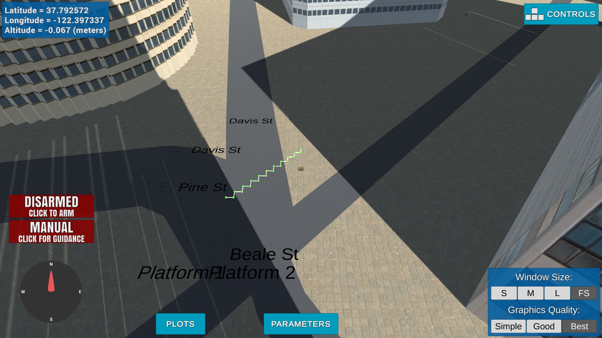
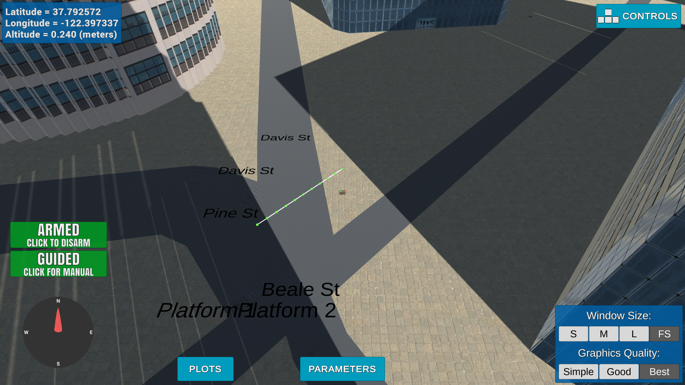
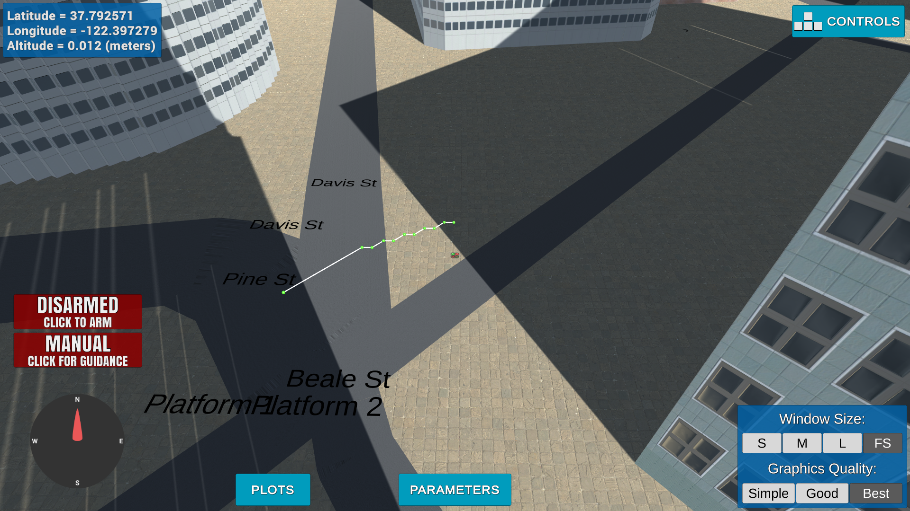
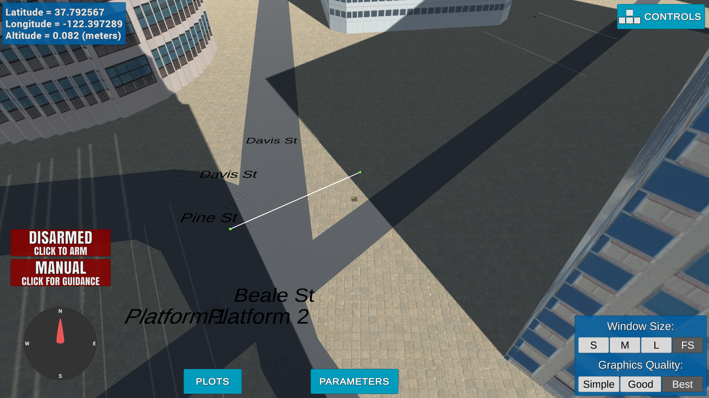

## Project: 3D Motion Planning


---


# Required Steps for a Passing Submission:
1. Load the 2.5D map in the colliders.csv file describing the environment.
2. Discretize the environment into a grid or graph representation.
3. Define the start and goal locations.
4. Perform a search using A* or other search algorithm.
5. Use a collinearity test or ray tracing method (like Bresenham) to remove unnecessary waypoints.
6. Return waypoints in local ECEF coordinates (format for `self.all_waypoints` is [N, E, altitude, heading], where the drone’s start location corresponds to [0, 0, 0, 0].
7. Write it up.
8. Congratulations!  Your Done!

## [Rubric](https://review.udacity.com/#!/rubrics/1534/view) Points
### Here I will consider the rubric points individually and describe how I addressed each point in my implementation.  

---
### Writeup / README

#### 1. Provide a Writeup / README that includes all the rubric points and how you addressed each one.  You can submit your writeup as markdown or pdf.  

You're reading it! Below I describe how I addressed each rubric point and where in my code each point is handled.

### Explain the Starter Code

#### 1. Explain the functionality of what's provided in `motion_planning.py` and `planning_utils.py`
- Added PLANNING state
- When quadrotor is armed, plans path and then takeoff transition 

-The goal here is to understand the starter code. We've provided you with a functional yet super basic path planning implementation and in this step, your task is to explain how it works! 
Have a look at the code, particularly in the plan_path() method and functions provided in planning_utils.py and describe what's going on there. 
This need not be a lengthy essay, just a concise description of the functionality of the starter code. 
- You should see the quad fly a jerky path of waypoints to the northeast for about 10 m then land. What's going on here? 
Your first task in this project is to explain what's different about motion_planning.py from the backyard_flyer_solution.py script, 
and how the functions provided in planning_utils.py work.

And here's a lovely image of my results (ok this image has nothing to do with it, but it's a nice example of how to include images in your writeup!)


Here's | A | Snappy | Table
--- | --- | --- | ---
1 | `highlight` | **bold** | 7.41
2 | a | b | c
3 | *italic* | text | 403
4 | 2 | 3 | abcd

### Implementing Your Path Planning Algorithm

#### 1. Set your global home position
I read the first line of the csv file, extract lat0 and lon0 as floating point values using regular expression operations and use the self.set_home_position() method to set global home.
```
# read lat0, lon0 from colliders into floating point values
# open colliders.csv file
file = open("colliders.csv", "r")
# read first line
data = file.readline();
# parse the first line with regular expression operations
p = re.compile('(\S+\d)')
m = p.findall(data)
lat0 = float(m[1])
lon0 = float(m[3])
# close the file
file.close()

# set home position to (lon0, lat0, 0)
self.set_home_position(lon0, lat0, 0)
```

#### 2. Set your current local position
I retrieve current global position with global_position attribute. Then I convert this global position to local position using global_to_local() function.
```
# retrieve current global position
start_global_position = self.global_position

# convert to current local position using global_to_local()
start_local_position = global_to_local(start_global_position, self.global_home)
```

#### 3. Set grid start position from local position
Using start local position, I define grid_start as shown as below.
```
# convert start position to current position rather than map center
grid_start = (int(start_local_position[0])-north_offset, int(start_local_position[1])-east_offset)
```

#### 4. Set grid goal position from geodetic coords
I create the desired goal location randomly. I define max and min ranges of goal global position using colliders.csv ranges. Random goal position can be located in any obstacle, so I check goal position whether there is collision or not. If there is a collision I define new goal until no collision.
```
# adapt to set goal as latitude / longitude position and convert
# minimum and maximum north coordinates
north_min = np.floor(np.min(data[:, 0] - data[:, 3]))
north_max = np.ceil(np.max(data[:, 0] + data[:, 3]))

# minimum and maximum east coordinates
east_min = np.floor(np.min(data[:, 1] - data[:, 4]))
east_max = np.ceil(np.max(data[:, 1] + data[:, 4]))

# Define ranges of random global position
min_global_pos = local_to_global(np.array([north_min, east_min, 10.0]), self.global_home)
max_global_pos = local_to_global(np.array([north_max, east_max, 60.0]), self.global_home)

# Define random goal position until grid goal is empty
while not self.is_goal_position_OK:
		self.goal_global_position[0] = np.random.uniform(min_global_pos[0], max_global_pos[0], 1)
		self.goal_global_position[1] = np.random.uniform(min_global_pos[1], max_global_pos[1], 1)
		self.goal_global_position[2] = np.random.uniform(min_global_pos[2], max_global_pos[2], 1)

		# Calc goal local position
		goal_local_position = global_to_local(self.goal_global_position, self.global_home)
		grid_goal = (int(goal_local_position[0])-north_offset, int(goal_local_position[1])-east_offset)

		if grid[grid_goal[0], grid_goal[1]] == 1:
				self.is_goal_position_OK = False
		else: 
				self.is_goal_position_OK = True
```

#### 5. Modify A* to include diagonal motion (or replace A* altogether)
Minimal requirement here is to modify the code in planning_utils() to update the A* implementation to include diagonal motions on the grid that have a cost of sqrt(2), but more creative solutions are welcome. Explain the code you used to accomplish this step.
add diagonal motions with a cost of sqrt(2) to your A* implementation
        # or move to a different search space such as a graph (not done here)
```
NORTH_EAST = (-1, 1, 1.414)
NORTH_WEST = (-1, -1, 1.414)
SOUTH_EAST = (1, 1, 1.414)
SOUTH_WEST = (1, -1, 1.414)
```

```
if (x - 1 < 0 or y + 1 > m) or grid[x - 1, y + 1] == 1:
		valid_actions.remove(Action.NORTH_EAST)
if (x - 1 < 0 or y - 1 < 0) or grid[x - 1, y - 1] == 1:
		valid_actions.remove(Action.NORTH_WEST)
if (x + 1 > n or y + 1 > m) or grid[x + 1, y + 1] == 1:
		valid_actions.remove(Action.SOUTH_EAST)
if (x + 1 > n or y - 1 < 0) or grid[x + 1, y - 1] == 1:
		valid_actions.remove(Action.SOUTH_WEST)
```


#### 6. Cull waypoints 
For this step you can use a collinearity test or ray tracing method like Bresenham. The idea is simply to prune your path of unnecessary waypoints. Explain the code you used to accomplish this step.


Collinearity (pruned_path = prune_path(path))
```
def point(p):
    return np.array([p[0], p[1], 1.]).reshape(1, -1)  

def collinearity_check(p1, p2, p3, epsilon=1e-6):   
    m = np.concatenate((p1, p2, p3), 0)
    det = np.linalg.det(m)
    return abs(det) < epsilon

def prune_path(path):
    pruned_path = [p for p in path]
    
    i = 0
    while i < len(pruned_path) - 2:
        p1 = point(pruned_path[i])
        p2 = point(pruned_path[i+1])
        p3 = point(pruned_path[i+2])
        
        # If the 3 points are in a line remove
        # the 2nd point.
        # The 3rd point now becomes and 2nd point
        # and the check is redone with a new third point
        # on the next iteration.
        if collinearity_check(p1, p2, p3):
            # Something subtle here but we can mutate
            # `pruned_path` freely because the length
            # of the list is check on every iteration.
            pruned_path.remove(pruned_path[i+1])
        else:
            i += 1
    return pruned_path 
```


Bresenham (pruned_path = prune_path_bres(path, grid))
```
def bresenham_check(p1, p2, grid, epsilon=1e-6):
    cells = list(bresenham(p1[0], p1[1], p2[0], p2[1]))
    for q in cells:
        if grid[q[0], q[1]] == 1:
            return False
    return True

def prune_path_bres(path, grid):
    pruned_path = [p for p in path]
    
    i = 0
    while i < len(pruned_path) - 2:    
        # If the 3 points are in a line remove
        # the 2nd point.
        # The 3rd point now becomes and 2nd point
        # and the check is redone with a new third point
        # on the next iteration.
        if bresenham_check(pruned_path[i], pruned_path[i+2], grid):
            # Something subtle here but we can mutate
            # `pruned_path` freely because the length
            # of the list is check on every iteration.
            pruned_path.remove(pruned_path[i+1])
        else:
            i += 1
    return pruned_path 
```



### Execute the flight
#### 1. Does it work?
It works!

### Double check that you've met specifications for each of the [rubric](https://review.udacity.com/#!/rubrics/1534/view) points.
  
# Extra Challenges: Real World Planning

For an extra challenge, consider implementing some of the techniques described in the "Real World Planning" lesson. You could try implementing a vehicle model to take dynamic constraints into account, or implement a replanning method to invoke if you get off course or encounter unexpected obstacles.


